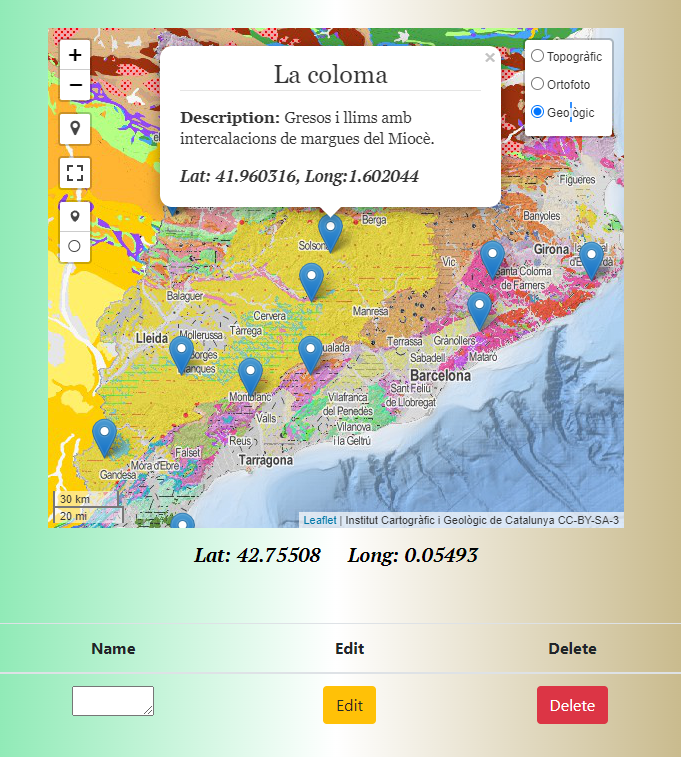

# Geo-app
## RESTful API using Node, Express, Postgres, Mapbox 
* Geo-app allows the user to create edit and delete locations and descriptions on a geological,  orthographic and topographic maps from the ICGC.

```bash
# Server on localhost:4000
npm run dev (nodemon)
or
npm start

# Routes Postman (Server)
GET all locations    		/api/layers/layer
Get one location, delete, update 	/api/layers/layer/:name

```

