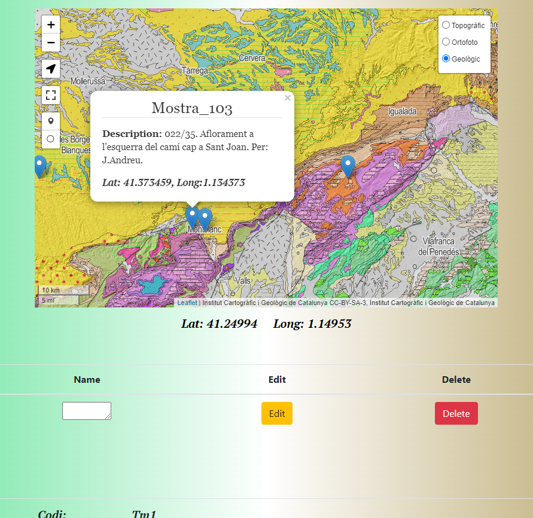
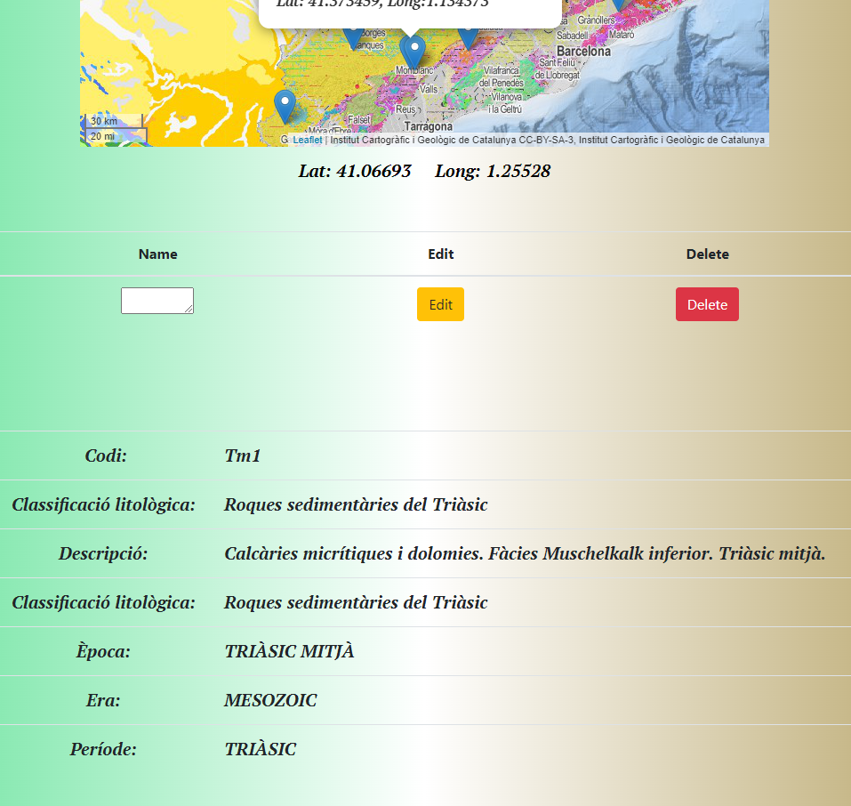

# Geo-app

REST API using Node, Express, Postgres, Leaflet.
Hosted on AWS using NGINX as a webserver.


[https://visualatles.cat](https://visualatles.cat)

<br>

* Geo-app allows the user to create edit and delete locations and descriptions on a geological,  orthographic and topographic maps being able to consult the geologic desciption from the ICGC.

<br>

```bash
# Server on localhost:4000
npm run dev (nodemon)
or
npm start

# Api routes (development)
GET all locations    		http://localhost:4000/api/layers/layer
Get one location, delete, update 	http://localhost:4000/api/layers/layer/:name

# Api routes (production)
GET all locations    		[https://visualatles.cat/api/layers/layer](https://visualatles.cat/api/layers/layer)
Get one location, delete, update 	[https://visualatles.cat/api/layers/layer/:name](https://visualatles.cat/api/layers/layer/Mostra_103)

```
<br>

<p align="center">


</p>